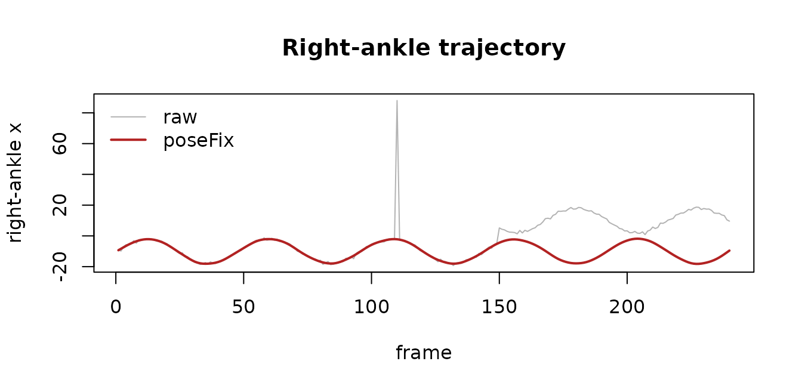
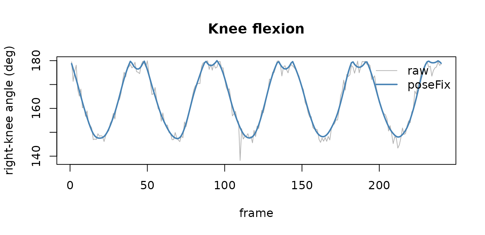

# Markerless pose to gait: OpenPose -\> poseFix -\> analysis

``` r

library(PhysioMoCap)
#> Loading required package: PhysioCore
```

## The pipeline

Markerless pose estimators (OpenPose, MediaPipe, DeepLabCut) turn
ordinary video into 2D keypoint trajectories, but those trajectories are
noisy: keypoints drop out, jump, and – as the legs cross during gait –
get their left/right labels swapped. This vignette runs the full chain:

    readOpenPose()  ->  poseFix()  ->  joint angles / gait metrics  ->  downstream
       (ingest)        (clean)          (analyse)

`PhysioMoCap` already ingests pose data
([`readOpenPose()`](https://x-biosignal.github.io/PhysioMoCap/reference/readOpenPose.md),
[`readMediaPipe()`](https://x-biosignal.github.io/PhysioMoCap/reference/readMediaPipe.md),
[`readDeepLabCut()`](https://x-biosignal.github.io/PhysioMoCap/reference/readDeepLabCut.md),
[`readOpenCap()`](https://x-biosignal.github.io/PhysioMoCap/reference/readOpenCap.md))
into a `PhysioExperiment`, and provides the downstream biomechanics.
[`poseFix()`](https://x-biosignal.github.io/PhysioMoCap/reference/poseFix.md)
is the cleaning step in between (a generalised implementation of the
method in Sugiyama, Uno & Matsui 2023, *PLOS Comput Biol* 19:e1009989).

## A recording (simulated OpenPose output)

To keep the vignette self-contained we simulate a short walking
recording with the same structure
[`readOpenPose()`](https://x-biosignal.github.io/PhysioMoCap/reference/readOpenPose.md)
returns – assays `keypoint_x`, `keypoint_y`, `confidence`, and named
keypoints – and inject the three characteristic errors.

``` r

labels <- c("Neck", "RShoulder", "LShoulder", "MidHip",
            "RHip", "RKnee", "RAnkle", "LHip", "LKnee", "LAnkle")
base_x <- c(0, -18, 18, 0, -10, -10, -10, 10, 10, 10)
base_y <- c(0, 15, 15, 60, 60, 105, 150, 60, 105, 150)
n <- 240; t <- seq_len(n)
sway <- 8 * sin(2 * pi * t / 48)               # gait sway
flex <- 6 * (1 - cos(2 * pi * t / 48))         # knee flexion over the cycle

X <- outer(rep(1, n), base_x); Y <- outer(rep(1, n), base_y)
colnames(X) <- colnames(Y) <- labels
for (kp in c("RKnee", "RAnkle")) X[, kp] <- X[, kp] + sway
for (kp in c("LKnee", "LAnkle")) X[, kp] <- X[, kp] - sway
X[, "RKnee"] <- X[, "RKnee"] + flex; X[, "LKnee"] <- X[, "LKnee"] - flex
X <- X + matrix(rnorm(n * ncol(X), 0, 0.6), n)
Y <- Y + matrix(rnorm(n * ncol(Y), 0, 0.6), n)
conf <- matrix(0.9, n, ncol(X), dimnames = list(NULL, labels))

# inject errors: a confidence dropout, a jump, and a left/right leg swap
conf[60, "RKnee"] <- 0.02                                        # dropout
X[110, "RAnkle"] <- X[110, "RAnkle"] + 90                        # jump
swap <- 150:n                                                    # leg-label swap
for (pr in list(c("RHip","LHip"), c("RKnee","LKnee"), c("RAnkle","LAnkle"))) {
  tx <- X[swap, pr[1]]; X[swap, pr[1]] <- X[swap, pr[2]]; X[swap, pr[2]] <- tx
  ty <- Y[swap, pr[1]]; Y[swap, pr[1]] <- Y[swap, pr[2]]; Y[swap, pr[2]] <- ty
}

pose <- PhysioCore::PhysioExperiment(
  assays = S4Vectors::SimpleList(keypoint_x = X, keypoint_y = Y, confidence = conf),
  colData = S4Vectors::DataFrame(label = labels, type = "keypoint",
                                 model = "BODY_25"),
  samplingRate = 30)
pose
#> class: PhysioExperiment
#> dim: 240 x 10 
#> assays(3): keypoint_x, keypoint_y, confidence
#> samplingRate: 30 Hz
#> channels(10): Neck, RShoulder, LShoulder, MidHip, RHip ...
#> colData names(3): label, type, model
```

## Clean with `poseFix()`

``` r

fixed <- poseFix(pose)
report <- S4Vectors::metadata(fixed)$poseFix
report$counts          # anomalies flagged, by criterion
#> low_confidence segment_length  temporal_jump    joint_angle 
#>              1              1              2             24
report$leg_swaps       # frames whose left/right legs were un-swapped
#> [1] 91
```

[`poseFix()`](https://x-biosignal.github.io/PhysioMoCap/reference/poseFix.md)
first restores left/right leg continuity, then flags keypoints on four
criteria (low confidence, implausible segment length, frame-to-frame
jump, out-of-range joint angle), sets them to `NA`, interpolates and
smooths.

## Before vs after

``` r

rx  <- SummarizedExperiment::assay(pose,  "keypoint_x")[, "RAnkle"]
rxc <- SummarizedExperiment::assay(fixed, "keypoint_x")[, "RAnkle"]
plot(rx, type = "l", col = "grey70", xlab = "frame",
     ylab = "right-ankle x", main = "Right-ankle trajectory")
lines(rxc, col = "firebrick", lwd = 2)
legend("topleft", c("raw", "poseFix"), col = c("grey70", "firebrick"),
       lwd = c(1, 2), bty = "n")
```



The jump at frame 110 and the left/right swap from frame 150 are gone;
the cleaned trajectory (red) is continuous.

## Downstream: knee flexion angle

The cleaned keypoints flow straight into analysis. Here is the
right-knee angle (hip-knee-ankle) computed from the raw vs cleaned
keypoints:

``` r

knee_angle <- function(pe, hip, knee, ankle) {
  X <- SummarizedExperiment::assay(pe, "keypoint_x")
  Y <- SummarizedExperiment::assay(pe, "keypoint_y")
  v1x <- X[, hip] - X[, knee]; v1y <- Y[, hip] - Y[, knee]
  v2x <- X[, ankle] - X[, knee]; v2y <- Y[, ankle] - Y[, knee]
  acos(pmin(pmax((v1x * v2x + v1y * v2y) /
    (sqrt(v1x^2 + v1y^2) * sqrt(v2x^2 + v2y^2)), -1), 1)) * 180 / pi
}
a_raw   <- knee_angle(pose,  "RHip", "RKnee", "RAnkle")
a_fixed <- knee_angle(fixed, "RHip", "RKnee", "RAnkle")
plot(a_raw, type = "l", col = "grey70", xlab = "frame",
     ylab = "right-knee angle (deg)", main = "Knee flexion")
lines(a_fixed, col = "steelblue", lwd = 2)
legend("topright", c("raw", "poseFix"), col = c("grey70", "steelblue"),
       lwd = c(1, 2), bty = "n")
```



The raw angle is corrupted by the errors; after
[`poseFix()`](https://x-biosignal.github.io/PhysioMoCap/reference/poseFix.md)
it is a clean, cyclic gait signal ready for step segmentation,
range-of-motion, or muscle-synergy and network analyses elsewhere in the
ecosystem.

## A simple gait metric

``` r

# steps from right-ankle-x peaks; cadence at 30 fps
pk <- which(diff(sign(diff(rxc))) < 0) + 1
cadence <- length(pk) / (n / 30) * 60          # steps per minute
round(cadence, 1)
#> [1] 37.5
```

## Where to go next

- For 3D marker or OpenSim-scaled data,
  \[[`calculateJointAngles()`](https://x-biosignal.github.io/PhysioMoCap/reference/calculateJointAngles.md)\]
  computes ISB / Grood-Suntay joint angles directly on a
  `PhysioExperiment`.
- Cleaned kinematics feed the rest of the ecosystem – e.g. EMG muscle
  synergies (`PhysioEMG`), musculoskeletal networks (`PhysioMSKNet`), or
  cross-modal and organ-interaction analyses.

## Reference

Sugiyama S, Uno K, Matsui Y (2023). Types of anomalies in
two-dimensional video-based gait analysis in uncontrolled environments.
*PLOS Computational Biology* 19:e1009989.
